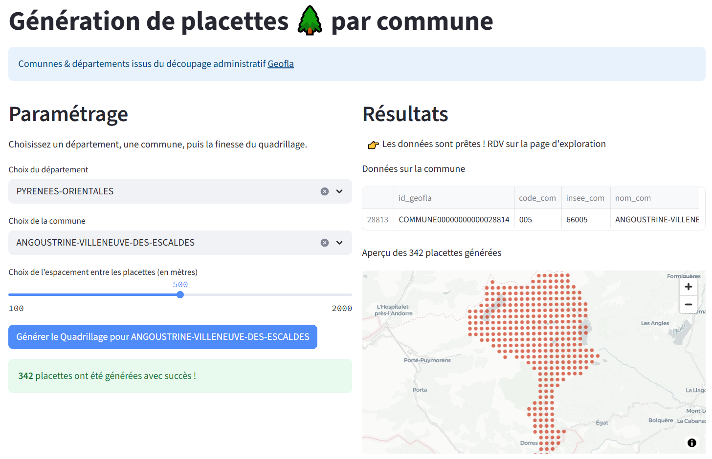
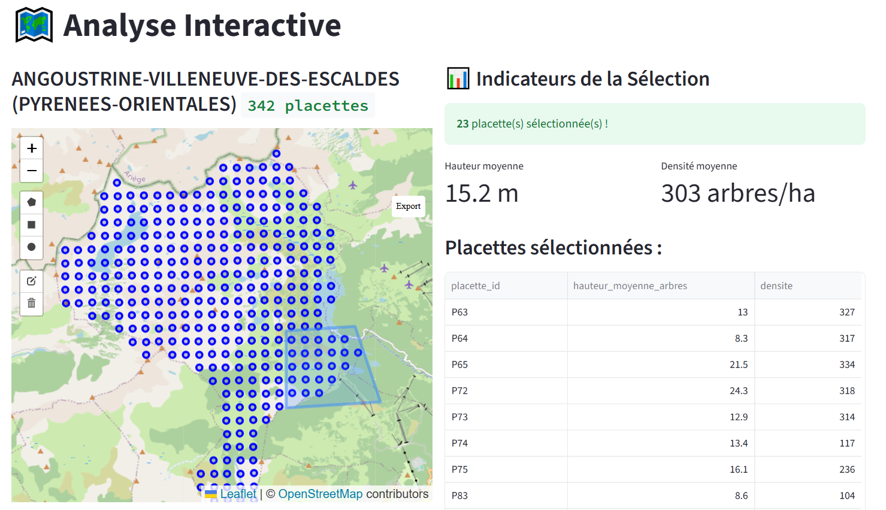

# Streamlit pour exploration de forêts (placettes)

Cette [app streamlit](https://simulation-placette-foret.streamlit.app) est née autour d'un besoin de l'Office National des Forêts (ONF) : pouvoir explorer des relevés de forêts. Des recensements sont réalisées dans nos forêts afin de connaître leur santé & disposition. Les forêts sont alors quadrillées en placettes et des relevés y sont associés (nb d'arbres & essences, hauteur moyenne, grosseur moyenne...).

Cette appplication contient 2 parties :

1. Génération d'un quadrillage **fictif** de placettes couvrant la supperficie d'une commune choisie

2. Exploration de ces données fictives

## Installation & commandes

1. installer uv 👉 cf. [doc astral/uv](https://docs.astral.sh/uv/getting-started/installation/)
2. lancer l'app streamlit : `uv run streamlit run home.py`

Ou en ligne sur Streamlit : 👉 [simulation-placette-foret.streamlit.app](https://simulation-placette-foret.streamlit.app/)

## Inspirations & ressources

- des institutions (ONF, IGN ...)
  - Reportage ONF de 3min [📹 Remesure des placettes permanentes - Inventaire de la forêt](https://www.youtube.com/watch?v=p8tglBAww8g)
- by [Gaël Penessot](https://github.com/gpenessot)
  - [Streamlit App Template](https://github.com/gpenessot/streamlit-app-template)
- by Snowflake
  - [Streamlit Getting Started demo](https://docs.snowflake.com/en/developer-guide/streamlit/getting-started#build-your-first-sis-app)
- by Streamlit
  - [Create a multi-app page](https://docs.streamlit.io/get-started/tutorials/create-a-multipage-app)
  - [Snowflake connexion](https://docs.streamlit.io/develop/tutorials/databases/snowflake#write-your-streamlit-app)